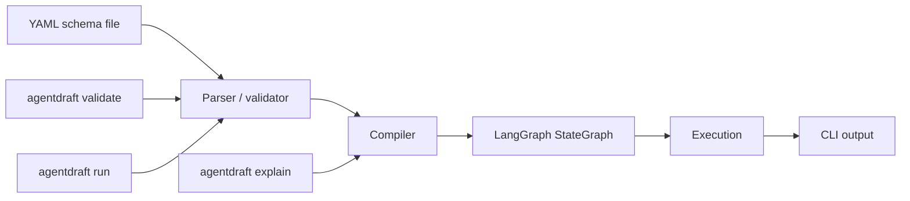

# Architecture — AgentDraft

See [README](README.md) for the doc map. See [PRD](PRD.md) for why this exists.

## 1. Design tenets

1. **No abstraction before a second real consumer.** AgentDraft compiles and runs directly against
   LangGraph. No execution-backend interface, no capability-negotiation layer, until AgentWeave
   exists and forces the seam (`ADR-003`). This extends to AgentDraft-owned local storage: no
   swappable-DB abstraction for the run ledger or schema version history until a second concrete
   backend need exists (`ADR-010`). Where an upstream library already provides multi-backend
   support with real consumers - LangChain's provider registry (`ADR-005`), LangGraph's
   checkpointers (`ADR-009`) - exposing it via a thin config field is not the abstraction this
   tenet rules out.
2. **The schema is the source of truth for structure; code is the source of truth for logic that
   can't be declared.** A schema describes nodes, edges, and config. A typed custom-code node
   references a plain Python callable when logic genuinely can't be expressed declaratively (`ADR-004`).
3. **Deep before wide.** Phase 1 covers one agent shape (single-agent, tool-calling) thoroughly
   rather than covering many shapes shallowly. Memory, sandboxing, and multi-agent composition are
   deferred, not half-built.
4. **Compile to the real thing, not a re-implementation.** The compiler's output is a genuine
   LangGraph `StateGraph`. AgentDraft does not reimplement graph execution, tool calling, or LLM
   invocation — it only translates schema into LangGraph's own primitives.

## 2. High-level architecture (Phase 1)

Everything left of `LangGraph StateGraph` is AgentDraft. Everything right of it — graph execution,
tool invocation, LLM calls — is LangGraph, called directly, per the governing principle.

## 3. Components

| Component | Responsibility | Tech | Interfaces |
|---|---|---|---|
| Schema parser | Load and structurally validate a YAML schema file, including its `schema_version` (`FR-1.10`, `ADR-006`) | Python, `pydantic` (or equivalent schema library) | Reads a file path, returns a typed schema object or a validation error |
| Compiler | Translate a validated schema object — including provider-agnostic LLM config (`ADR-005`) — into a LangGraph `StateGraph` | Python, `langgraph`, `langchain` (for `init_chat_model`) | Takes a schema object, returns a compiled `StateGraph` |
| Custom-code loader | Resolve a schema's `handler: module:function` references to real Python callables (`FR-1.6`) | Python `importlib` | Takes an import-path string, returns a callable; raises a clear error if unresolvable |
| CLI | User-facing entry point: `validate`, `run`, `explain` (text or JSON, `FR-3.5`) | Python, `click` or `argparse` | Reads schema file paths and flags from argv; prints to stdout/stderr |
| Canvas frontend | Read-only rendering (`FR-4.1`, Phase 2.1) and full editing (`FR-4.2`, Phase 2.2) of a compiled schema's structure | TypeScript, React, Vite, React Flow (`@xyflow/react`), `dagre` (`ADR-007`) | View-only: loads a `FR-3.5` JSON export client-side, no backend. Editing: fetches/saves against the local API server below (`ADR-007`, `ADR-008`) |
| Canvas API server (Phase 2.2) | Local, localhost-only HTTP API backing an editing session: read the current graph, validate and persist an edit (`FR-4.3`), suggest and preview known callables (`FR-4.5`) | Python stdlib `http.server` + `ast` (no new dependency) | `GET /api/graph`, `POST /api/save`, `GET /api/callables`, `GET /api/source?ref=...`; graph parsing/validation goes through the same `Schema` pydantic models the CLI uses, no duplicated logic (`ADR-008`); callable discovery/preview is a static AST scan, not an import, so it never executes project code and never writes to Python files (`ADR-004` stays intact - the canvas only ever references code, never authors it) |
| Local store (Phase 3) | One shared SQLite file backing `schema_versions` and `runs` (`ADR-010`), plus LangGraph's own checkpoint tables when `checkpointer.backend: sqlite` (`ADR-009`) | Python stdlib `sqlite3`, no ORM | Written by `save_schema` (version history, `FR-9.1`) and the run executor (`FR-6.1`); read by `agentdraft schema log/diff` and `agentdraft runs list/show/prune`; see [DATA-MODEL](DATA-MODEL.md) |
| Checkpointer integration (Phase 3) | Passes a LangGraph-native checkpointer (`SqliteSaver`/`PostgresSaver`) into `StateGraph.compile()` when a schema declares `checkpointer` (`FR-5.1`); resolves `--resume <thread_id>` into a re-invocation against that thread | `langgraph.checkpoint.sqlite`/`langgraph.checkpoint.postgres` | Compiler-level: takes a validated schema's `checkpointer` config, returns the checkpointer instance the compiled graph is built with (`ADR-009`) |
| Observability instrumentation (Phase 3) | Emits OpenTelemetry spans from LangGraph/LangChain's callback hooks: one root span per run, one child span per node (`FR-7.1`, `FR-7.2`) | `opentelemetry-sdk`, `opentelemetry-exporter-otlp` | No inbound interface - a callback attached at compile/execution time; export destination is entirely env-var driven (`FR-7.3`, [OBSERVABILITY.md](OBSERVABILITY.md)) |
| Eval runner (Phase 3) | Compiles a schema once, runs each case from an evals file, checks deterministic assertions against final state (`FR-8.1`-`FR-8.4`) | Python, reuses the compiler/loader - no new execution path | `agentdraft eval <schema> <evals-file>`; exits `4` on assertion failure (`ADR-012`) |

No meta-agent, no backend adapter layer exists yet — see [ROADMAP](ROADMAP.md) for when each is
introduced.

## 4. Key flows

### 4.1 `agentdraft validate <schema>`
1. Parser loads the YAML file and checks it against the schema's structural rules (required fields, valid node/edge references, no orphan nodes).
2. On success: exit 0, print a confirmation.
3. On failure: exit non-zero, print the specific field/line and what's wrong — not a raw LangGraph or YAML-library stack trace.

### 4.2 `agentdraft run <schema>`
1. Parser loads and validates the schema (same as `validate`).
2. Compiler walks the schema and builds a LangGraph `StateGraph`: one LangGraph node per schema node, edges wired per the schema's routing (including conditional edges, which may self-loop back to an earlier node - e.g. a reflection/self-correction cycle - optionally bounded by `max_visits`/`fallback`, `FR-1.12`), tool bindings attached per node.
3. For any node/edge with a `handler` reference (`FR-1.6`), the custom-code loader resolves and attaches the Python callable in place of declarative config.
4. The compiled graph is invoked via LangGraph's own execution.
5. Output streams to stdout as the agent runs.

### 4.3 `agentdraft explain <schema>`
1. Parser + compiler run as in `run`, but execution is skipped.
2. The compiled graph's structure (nodes, edges, routing conditions, tool bindings) is printed as text.
3. This is a deliberate, minimal precursor to the canvas (Phase 2) — same compiled structure, text
   rendering instead of a visual one.

### 4.4 Exit codes

All CLI commands share one exit-code taxonomy (`FR-3.4`), so scripts and future MCP tool wrappers
can branch on failure class without parsing error text:

| Code | Meaning | Raised by |
|---|---|---|
| `0` | Success | Any command |
| `1` | Validation error (malformed schema, unresolved reference, unrecognized `schema_version` or provider) | `validate`, `run`, `explain` |
| `2` | Compile error (schema is structurally valid but fails to compile — e.g. an unresolvable `handler` reference) | `run`, `explain` |
| `3` | Runtime/execution error (LangGraph itself raises during `run`, e.g. a tool call or LLM call fails) | `run` |
| `4` | Eval assertion failure: every case ran to completion, but at least one assertion failed (`ADR-012`) | `eval` |

### 4.5 `agentdraft explain <schema> --format json` + canvas (Phase 2.1)
1. Parser + compiler run as in `explain`; execution is skipped.
2. `schema_structure()` builds one structured representation of the graph (nodes, edges, routing,
   tool bindings) — the single source of truth both `explain`'s text rendering and this JSON
   output read from, so the two cannot diverge (`FR-3.5`, `ADR-007`).
3. The JSON is written to stdout (or redirected to a file by the user).
4. The canvas frontend (`canvas/`, run separately via `npm run dev`) loads that JSON file
   client-side and renders it read-only with React Flow — no backend process, no interface back
   to the Python compiler beyond the file itself (`FR-4.1`, `ADR-007`).

### 4.6 `agentdraft canvas <schema>` + canvas editing (Phase 2.2)
1. `_load_schema_or_exit` validates the schema up front; an already-invalid schema fails fast
   (exit 1) before any server starts.
2. `run_canvas_server` binds a local `ThreadingHTTPServer` (`127.0.0.1`, an OS-picked port by
   default) and prints its URL (`FR-4.3`, `ADR-008`).
3. The canvas frontend, pointed at that URL via `VITE_API_BASE`, fetches `GET /api/graph` on load
   instead of the 2.1 file picker, and renders it editable (`FR-4.2`).
4. On save, the frontend `POST`s its edited structure to `/api/save`. The server parses it via
   `schema_from_structure` into the same `Schema` pydantic model `load_schema` uses — every
   existing validation rule (`FR-1.1`-`FR-1.6`) applies with no duplicated logic.
5. Valid: `save_schema` (`FR-1.11`) writes the file, `200 {"ok": true}`. Invalid: `422
   {"errors": [...]}` with the same field-specific text the CLI prints (`format_validation_errors`,
   `FR-4.4`, `NFR-2.1`); the frontend keeps the user's in-progress edits and surfaces the errors
   rather than discarding anything.
6. `Ctrl+C` stops the server; 2.1's static/no-backend viewing mode is untouched by any of this.

### 4.7 `agentdraft run <schema> --resume <thread_id>` (Phase 3.1)

1. Parser + compiler run as in `run`, additionally passing the schema's `checkpointer` config
   (`FR-5.1`) into `StateGraph.compile()`.
2. Instead of invoking from `START`, the compiled graph is invoked against the given `thread_id`;
   LangGraph's own checkpoint-replay logic resumes from the last persisted checkpoint for that
   thread (`ADR-009`) - AgentDraft does not implement resume logic itself.
3. An unknown `thread_id`, or a schema with no `checkpointer` configured, fails with a specific
   error before any execution starts (`FR-5.3`, `FR-5.5`).
4. A new run-ledger row is written either way (`FR-6.1`), so a resumed run's history is visible
   alongside the original interrupted one.

### 4.8 `agentdraft eval <schema> <evals-file>` (Phase 3.5)

1. The evals file is parsed and validated (`FR-8.1`); a malformed file fails before the schema is
   even loaded, with a field-specific error (`NFR-2.1`).
2. Parser + compiler run once, as in `run`.
3. Each case's input state is invoked through the compiled graph; final state is checked against
   that case's assertions (`FR-8.3`) - field equality, substring, or regex via a dotted/indexed
   path.
4. Pass/fail per case is printed, plus a summary; exit code `4` if any assertion failed anywhere,
   otherwise `0`-`3` per the existing taxonomy for evals-file/schema/runtime errors (`FR-8.4`,
   `ADR-012`).

## 5. Multi-tenancy & isolation

Not applicable. Single local user, no accounts, no shared state, no hosting in the current
roadmap horizon (Phase 0-3). See [PRD §2](PRD.md#2-goals--non-goals) — hosted/collab is deferred,
not excluded, but no isolation model is designed against it yet.

## 6. Scale & capacity model

Not applicable at this stage. AgentDraft runs locally, on demand, for one user, on agents small
enough to hand-author in YAML. No throughput, concurrency, or storage-volume targets exist for
Phase 1. *Assumption: revisit if a hosted/multi-user version is ever pursued (deferred per [PRD](PRD.md)).*

## 7. Failure modes & degradation

| Failure | What happens | What the user gets |
|---|---|---|
| Malformed schema (missing field, bad reference) | `validate`/`run` fails before compilation | A specific error naming the field and the problem |
| Schema references a `handler` that doesn't resolve (bad import path, missing function) | Compilation fails at the custom-code loading step | A clear import error, not a bare Python traceback |
| Schema construct not supported in Phase 1 (e.g. a memory config field) | Validation fails | An explicit "not supported in this version" error, not silent ignoring or a downstream LangGraph failure |
| LangGraph itself raises during execution (e.g. a tool call fails, an LLM call errors) | AgentDraft does not catch/reinterpret LangGraph's own runtime errors | LangGraph's native error surfaces as-is — AgentDraft is a thin compiler, not a runtime wrapper, per tenet 4 |
| LangGraph upstream breaking change | Compiler may fail against a newer LangGraph version | AgentDraft pins a tested LangGraph version per release (`ADR-003` consequence) rather than tracking latest |
| `agentdraft run --resume` given an unknown/nonexistent `thread_id` (Phase 3) | Fails before any execution starts | A specific "no checkpoint found for thread_id" error, not a bare LangGraph traceback (`FR-5.3`) |
| Process killed mid-run with `checkpointer` configured (Phase 3) | The run ledger row is left at `status: running`; the checkpointer's own last-persisted checkpoint (if any) still exists | `agentdraft runs list` reconciles a stale `running` row to `interrupted` at read time ([DATA-MODEL §4](DATA-MODEL.md#4-consistency--concurrency)); the user resumes with `--resume <thread_id>` if a checkpoint exists, or re-runs otherwise |
| `checkpointer.backend: postgres` configured but the database is unreachable (Phase 3) | Compilation succeeds; execution fails on first checkpoint write | LangGraph's own connection error surfaces, per tenet 4 - AgentDraft does not reinterpret it |
| OTLP endpoint configured but unreachable (Phase 3) | Span export fails silently in the background (standard OTel SDK behavior) | The run itself is unaffected - tracing is best-effort and never blocks or fails a run (`NFR-8.1`) |

Phase 1 had no durability/resume story. Phase 3 adds an opt-in one (`checkpointer`, `FR-5`) - a
schema with no `checkpointer` block still has none, by design (`FR-5.5`).

## 8. Cross-cutting

- **Security:** the custom-code escape hatch (`FR-1.6`) executes arbitrary local Python by design —
  no sandboxing in Phase 1 (deferred, `NFR-4.1`). Acceptable because AgentDraft is local-only,
  single-user, and the author is the one authoring the schema. The canvas's local API server
  (`FR-4.3`) has no authentication either (`NFR-4.2`, `ADR-008`) — same accepted trust boundary,
  binds to `127.0.0.1` only.
- **Config/secrets:** LLM API keys and similar secrets are read from the environment (e.g.
  `OPENAI_API_KEY`), never stored in or read from the schema file itself. `checkpointer.backend:
  postgres` connection strings follow the same rule - an env var reference, never inline in the
  schema (`FR-5.1`). Observability export config is entirely standard OTel environment variables
  (`OTEL_EXPORTER_OTLP_ENDPOINT` etc., `FR-7.3`) - no AgentDraft-specific config file.
- **Idempotency/consistency (Phase 1-2):** not applicable - no persisted state to keep consistent.
  **Phase 3:** checkpoint resume covers graph *state* only, not the real-world side effects of
  already-executed custom-code nodes; AgentDraft does not attempt at-least-once/exactly-once
  semantics for those effects (`ADR-009` consequence) - the same trust boundary the custom-code
  escape hatch (`ADR-004`) already carries. The local SQLite store's own consistency/concurrency
  behavior is covered in [DATA-MODEL §4](DATA-MODEL.md#4-consistency--concurrency).

## 9. Testing & CI

**Test types:**

| Type | Target | Notes |
|---|---|---|
| Unit | Schema parser, compiler, custom-code loader | Every parser/compiler code path covered (`NFR-6.1`); this is the project's core correctness bar (`NFR-1.1`), not optional polish |
| End-to-end | `validate`/`run`/`explain` against fixture schemas | LLM calls mocked/stubbed — deterministic, free, no network dependency (`NFR-6.2`) |
| Golden-file / snapshot | `explain` output | Compiled-structure regressions show up as a diff against a committed golden file, catching unintended compiler changes in review (`NFR-6.3`) |
| Crash/resume | `agentdraft run --resume` (Phase 3) | An e2e test kills the process mid-run and asserts `--resume` continues correctly (`NFR-7.1`) |
| Eval fixtures | `agentdraft eval` (Phase 3) | Fixture evals files with known-passing and known-failing cases, asserting the correct exit code (`0` vs. `4`, `FR-8.4`) and correct per-case pass/fail reporting |

**CI pipeline:** lint (`ruff`), type-check (`mypy`/`pyright`), unit tests, e2e tests — all run on every
commit/PR, not only at phase boundaries (`NFR-6.4`). Gating only at phase completion would let
regressions accumulate silently between phases on a project with no fixed schedule; continuous CI
catches them where they're introduced.

**Canvas CI (Phase 2.3):** a second `canvas` job in the same workflow — type-check + build,
Vitest unit/component tests, and one Playwright e2e test that spawns the real `agentdraft canvas`
server (not a mock) and drives an actual add-node/wire-edge/save round trip through a real
browser, asserting the schema file on disk changed and still passes `agentdraft validate`. This is
the practical form of the Phase 2 sync guarantee ([ROADMAP](ROADMAP.md)): the e2e test would fail
if the canvas and the CLI's validation ever disagreed on what a valid edit looks like.

Type-checking matters more here than in typical CLI glue code, because `FR-2.5`'s library API
(§3, Compiler) is a real contract — first for the CLI, later for the planned MCP server
([ROADMAP](ROADMAP.md)) — not just internal wiring.

**Structured errors, not just error messages.** Library functions raise typed exceptions (error
code + field/reference path), which the CLI renders as human-readable text (`NFR-2.1`). This
separation is tested directly: unit tests assert on the structured exception, not on stdout
formatting, so error-quality tests don't break every time CLI output wording changes.

**A phase is complete when:** CI is green *and* that phase's specific FR/NFR acceptance criteria
are met — CI passing alone is necessary but not sufficient (see [ROADMAP](ROADMAP.md) for
per-phase exit criteria).
