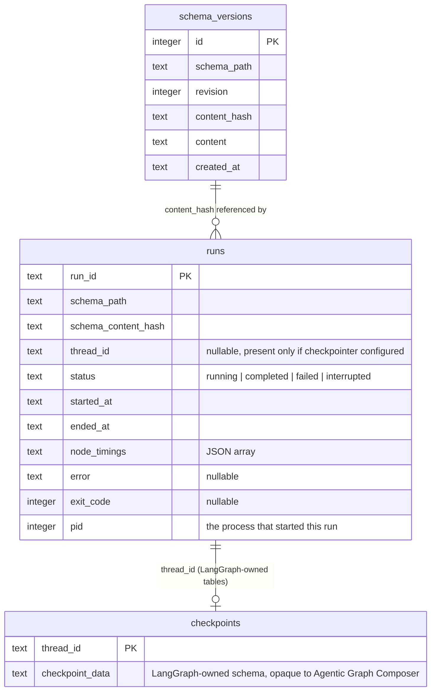

# Data model - Agentic Graph Composer local store

See [README](README.md) for the doc map. See [ADR-010](ADRs.md#adr-010---local-persistence-store-single-shared-sqlite-file-no-db-abstraction)
for why this is one shared SQLite file with no DB abstraction, and [ADR-009](ADRs.md#adr-009---checkpointing-backend-langgraph-native-checkpointers)
for why checkpoint tables are LangGraph's own schema, not Agentic Graph Composer's.

## 1. ER overview

`schema_versions` and `runs` are joined loosely, by `content_hash`, not a foreign key - a run can
reference a schema revision that was never explicitly saved through `save_schema` (e.g. a
hand-edited file run directly via the CLI without going through the canvas). This keeps the two
features independently useful: run history works even for a project that's never used schema
version history, and vice versa (`FR-6.1`, `FR-9.1`).

`runs.thread_id`, when present, is the same `thread_id` LangGraph's checkpointer keys its own
tables by (`ADR-009`) - that's the one real foreign-key-shaped relationship in this store, and the
reason `ADR-010` chose one shared file over separate ones: a `runs` row and its checkpoint state
live in the same file without a second connection.

## 2. Canonical schema

### `schema_versions` (Agentic Graph Composer-owned, `FR-9.1`-`FR-9.4`)

| Field | Type | Notes |
|---|---|---|
| `id` | `INTEGER PRIMARY KEY` | Autoincrement |
| `schema_path` | `TEXT` | Relative to the project's import root ([ARCHITECTURE §3](ARCHITECTURE.md#3-components)) |
| `revision` | `INTEGER` | Monotonic per `schema_path`, starting at 1 |
| `content_hash` | `TEXT` | SHA-256 of the saved YAML bytes |
| `content` | `TEXT` | Full YAML snapshot - not a diff (see §5) |
| `created_at` | `TEXT` | ISO-8601 UTC timestamp |

Indexed on `(schema_path, revision)`. A save whose content hash matches the current latest revision
for that path does not insert a new row (`FR-9.1`).

### `runs` (Agentic Graph Composer-owned, `FR-6.1`-`FR-6.4`)

| Field | Type | Notes |
|---|---|---|
| `run_id` | `TEXT PRIMARY KEY` | UUID4 |
| `schema_path` | `TEXT` | Relative to the project's import root |
| `schema_content_hash` | `TEXT` | SHA-256 of the schema file's content at run time - self-describing even if no `schema_versions` row matches it |
| `thread_id` | `TEXT`, nullable | Set only when `checkpointer` is configured (`FR-5.1`) |
| `status` | `TEXT` | `running` \| `completed` \| `failed` \| `interrupted` |
| `started_at` / `ended_at` | `TEXT`, nullable | ISO-8601 UTC; `ended_at` null while `status = running` |
| `node_timings` | `TEXT` (JSON) | `[{node, started_at, ended_at, status}, ...]` - a JSON column, not a normalized child table (see §5) |
| `error` | `TEXT`, nullable | Final error message/summary if `status = failed` |
| `exit_code` | `INTEGER`, nullable | The CLI exit code the run ended with |
| `pid` | `INTEGER` | The OS process id that started this run - the liveness check backing the `running` -> `interrupted` reconciliation (§4) |

Indexed on `(schema_path, started_at)` for `agc runs list` (`FR-6.2`).

### LangGraph checkpoint tables (LangGraph-owned, `ADR-009`)

When `checkpointer.backend: sqlite`, LangGraph's `SqliteSaver` creates and manages its own tables
(`checkpoints`, `checkpoint_writes`, etc., per its own internal schema) inside the same
`.agc/state.db` connection. Agentic Graph Composer treats this schema as opaque - it never reads or
writes these tables directly, only passes the checkpointer instance to `StateGraph.compile()`
(`ADR-009`) and reads `runs.thread_id` back out to construct a `--resume` command. A `postgres`
backend keeps these tables in the configured Postgres instance instead; `schema_versions` and
`runs` stay in the local SQLite file regardless of checkpointer backend (`ADR-010`).

## 3. Source → canonical mapping

Not applicable - there is no external data ingestion. Both tables are written exclusively by
Agentic Graph Composer's own CLI/library code (`save_schema` for `schema_versions`; the run executor for
`runs`), never by an external system or a user directly.

## 4. Consistency & concurrency

- `runs` rows are written incrementally: an insert at run start (`status: running`), an update at
  run end (`status`, `ended_at`, `node_timings`, `error`, `exit_code`). A process killed
  mid-execution (`SIGKILL`, no chance to run cleanup code) leaves a row stuck at `status: running`
  - `agc runs list`/`show` reconcile this by treating a `running` row whose `pid` is no
  longer alive as `interrupted` at read time (a POSIX `kill(pid, 0)` liveness check; a permission
  error or unsupported-platform ambiguity is conservatively treated as still alive), rather than
  requiring a clean shutdown to record it correctly. `prune` (`FR-6.4`) applies the same check and
  never deletes a row that's still genuinely in flight.
- SQLite's own locking governs concurrent access (`ADR-010`'s accepted limitation): safe for the
  single local user this store is scoped to, not evaluated for concurrent multi-process load beyond
  that.

## 5. Storage-shape decisions

- **Full snapshots, not diffs, in `schema_versions.content`.** Schema files are small (single-digit
  KB); storing full text per revision is simpler and more robust than reconstructing a revision
  from a diff chain, at the cost of some redundant storage - an explicit simplicity-over-footprint
  choice consistent with this project's technical-decision defaults. `agc schema diff`
  (`FR-9.3`) computes its diff on read, from two full snapshots.
- **`node_timings` as a JSON column, not a normalized child table.** A per-node child table would
  be more directly queryable in SQL, but at local/single-user scale ([ARCHITECTURE §6](ARCHITECTURE.md#6-scale--capacity-model))
  the query pattern is always "all timings for one run," which a JSON blob serves without a join.
  Revisit only if a query pattern actually needs SQL-level filtering across node timings, which
  nothing in this scope does today.
